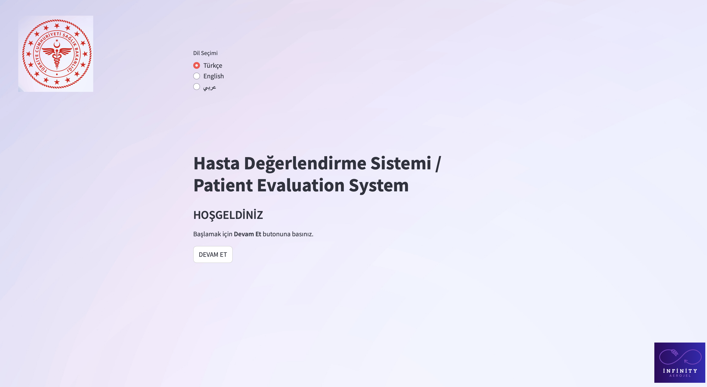
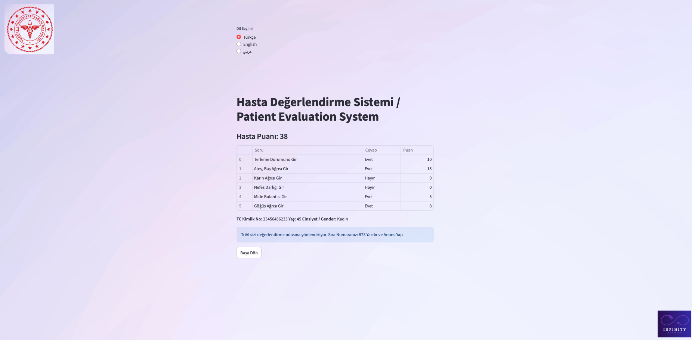

# HASTA DEĞERLENDİRME SİSTEMİ

Hastaların öncelik sırasına göre hızlı ve etkin şekilde değerlendirildiği, uygun birimlere 
yönlendirildiği bütüncül bir sistem geliştirdik. Sistemimiz, hem fiziksel cihaz hem yapay zekâ 
teknolojileriyle hastane yoğunluklarını ve doktor yükünü azaltmayı hedeflemektedir.

## Proje Aşamaları:

- Acil-Matik: Dokunmatik ekranlı, yapay zekâ destekli ilk temas noktasıdır. 
Hastalar burada şikayetlerini girer ve sistem ön değerlendirme yapar.

- Oda Sistemi: TriAI tarafından yönlendirilen hasta, hemşire eşliğinde ölçüm ve değerlendirmeye alınır; 
ardından uygun birime yönlendirilir.

## Kullanılan Yöntemler:

- Görsel ve sesli yönlendirme ile kullanıcı deneyimi artırılmıştır.
- Temel yazılım algoritmaları ve yapay zekâ modelleri ile doğru önceliklendirme sağlanmaktadır.
- Kullanıcı dostu arayüz tasarımıyla kolay ve hızlı işlem imkanı sunulmaktadır.

## Yenilikçi Özellikler:

- Fiziksel cihaz ve yapay zekâ tabanlı yazılımın birleşimiyle benzersiz bir kullanıcı deneyimi sunar.
- TriAI algoritması ile akıllı ve dinamik öncelik sıralaması yaparak hastaların hızlı ve doğru yönlendirilmesini sağlar.
- Steril, temassız ve hızlı işlem imkanıyla enfeksiyon riskini azaltır.
- Sağlık personelinin iş yükünü hafifleterek verimliliği artırır ve kaynak kullanımını optimize eder.

## Sonuç ve Öneriler:
- Sistemimiz, hastanelerde verimliliği artırarak hastaların bekleme sürelerini anlamlı şekilde 
azaltmaktadır. Prototip aşamasındaki uygulamamız, gerçek dünyadaki ihtiyaçlara göre geliştirilmeye
devam edecektir.

- Gelecekte, e-Nabız entegrasyonu ile hasta verilerinin daha etkin kullanılması, farklı yaş gruplarına
özel modların geliştirilmesi ve daha ileri yapay zeka modelleri ile sistemin hassasiyet ve doğruluğunun 
artırılması planlanmaktadır. Böylece hem hasta memnuniyeti hem de sağlık çalışanlarının verimliliği 
daha da iyileştirilecektir.


## PROJENİN KURULMASI

```bash

#Sanal ortam oluşturma
python3 -m venv infinity-aerojel-demo

#Sanal ortamı aktifleştirme
source infinity-aerojel-demo/bin/activate

#Gereksinimleri yükleme
pip install -r requirements.txt
```

## KULLANIM

Proje demosu streamlit kütüphanesi kullanılarak yazılmıştır.

```bash
streamlit run infinity-aerojel-demo.py
```

Link: http://localhost:8501

Aşağıda örnek bir ekran görüntüsü verilmiştir.



Örnek bir sonuç ekranı aşağıdaki gibidir:



Ayrıca Türkçe, Arapça ve İngilizce dilleri desteklenemektedir.